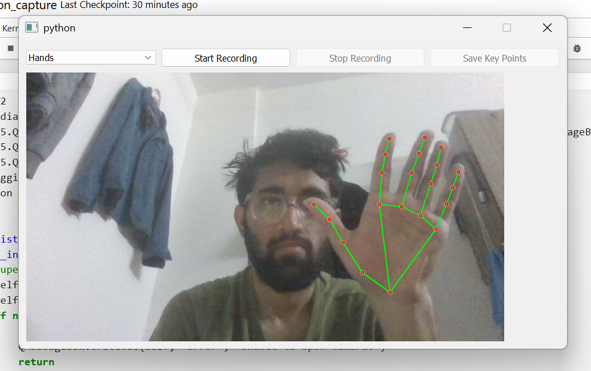
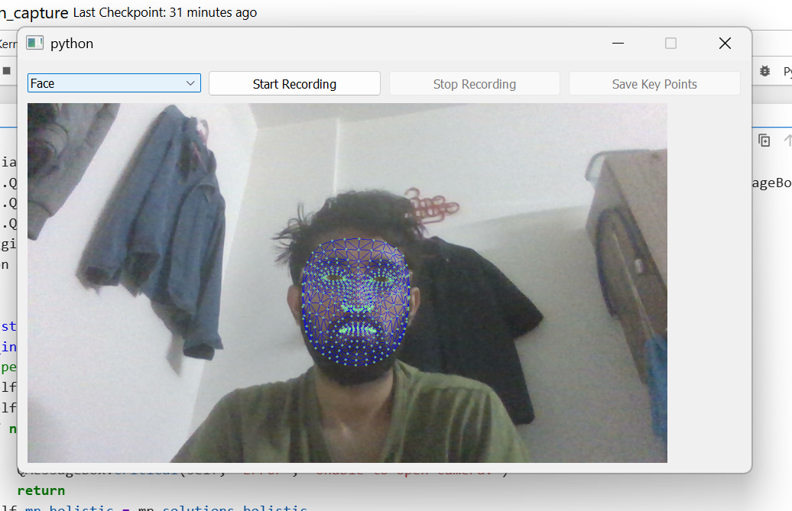
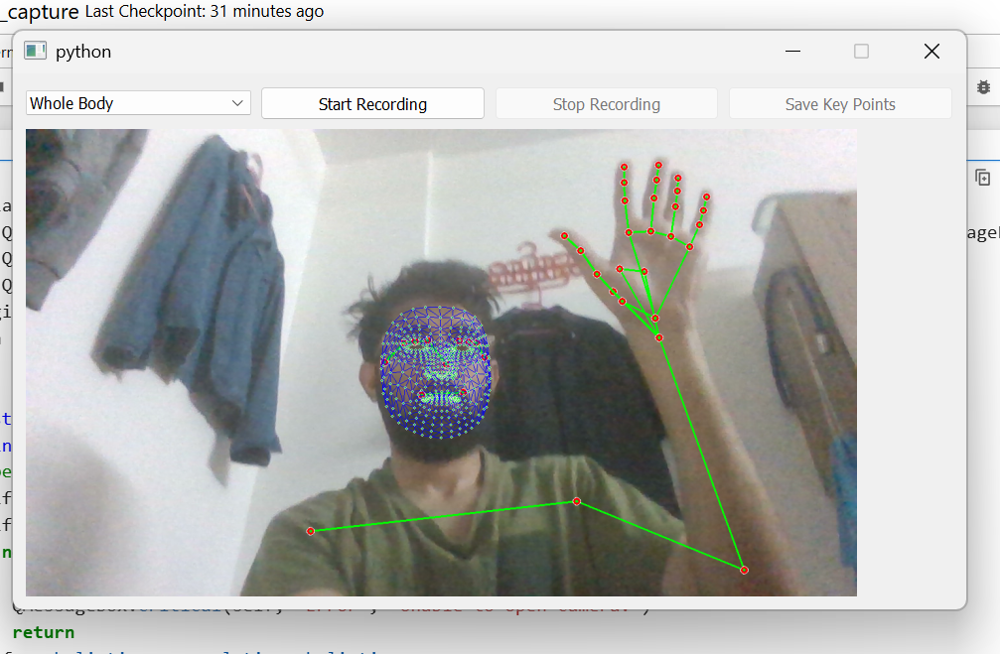

# AI-Based Human Landmark Detection and Recording System

## 📖 Introduction

Human pose estimation is a core task in computer vision that involves
detecting keypoints on the human body such as joints, facial landmarks,
and hand positions.

This project implements a complete real-time keypoint detection pipeline
with a professional GUI. The system captures webcam input, processes
each frame using MediaPipe Holistic, and extracts landmark coordinates
for selected body parts.

The extracted data is stored in JSON format and can be used for: 
- Machine Learning model training
- Gesture recognition
- Motion analysis
- Human-computer interaction
- Animation and game development
- Biomechanics and sports analysis

------------------------------------------------------------------------

## 🖼 Output Results

### Hand Landmark Detection



### Face Landmark Detection



### Full Body Landmark Detection



### JSON Keypoint Output


------------------------------------------------------------------------

## 🔁 System Pipeline

Webcam Input → OpenCV → MediaPipe Holistic → Landmark Extraction → PyQt5
GUI → JSON Storage

------------------------------------------------------------------------

## 🚀 Features

-   Real-time pose, face, and hand landmark detection
-   Selective tracking (Whole Body, Face, Hands, Legs)
-   Records normalized 3D coordinates (x, y, z)
-   Save data in JSON format for ML training
-   Professional PyQt5 GUI

------------------------------------------------------------------------

## 🛠️ Tech Stack
* **Core Logic:** Python, OpenCV, MediaPipe
* **Desktop Framework:** PyQt5
* **Data Handling:** JSON, NumPy
* **Logging:** Integrated Python Logging for real-time monitoring.

------------------------------------------------------------------------

### Prerequisites
* Python 3.9 or higher
* A webcam

## 💻 Installation

``` bash
git clone https://github.com/yourusername/human-landmark-detection.git
cd human-landmark-detection
python -m venv venv
venv\Scripts\activate
pip install opencv-python mediapipe PyQt5 numpy
```

------------------------------------------------------------------------

## ▶ Run

``` bash
python main.py
```

------------------------------------------------------------------------

## 🎮 How to Use

1.  Launch the application\
2.  Webcam opens automatically\
3.  Select body part from dropdown\
4.  Click Start Recording\
5.  Perform movements\
6.  Click Stop Recording\
7.  Click Save Key Points\
8.  Save JSON file

------------------------------------------------------------------------

## 📊 Applications

-   Machine Learning Dataset Creation
-   Gesture Recognition
-   Motion Capture
-   Pose Classification
-   Animation and Game Development

------------------------------------------------------------------------

## 📁 Project Structure

    human-landmark-detection/
    │
    ├── main.py
    ├── README.md
    └── images/
        ├── hand_detection.png
        ├── face_detection.png
        ├── full_body_detection.png
        └── json_output.png

------------------------------------------------------------------------
## 🔮 Future Improvements

-   Dataset labeling tool
-   Export to CSV format
-   Integrated ML training module
-   Real-time gesture classification
-   Multi-person detection

------------------------------------------------------------------------

## 🛠 Troubleshooting

### Webcam Not Opening

-   Ensure no other application is using the camera
-   Try changing camera index:

``` python
cv2.VideoCapture(1)
```

### MediaPipe Errors

``` bash
pip install mediapipe==0.10.0
```

### GUI Not Launching

``` bash
pip install PyQt5
```
------------------------------------------------------------------------

## 📄 License

MIT License

⭐ Star the repository if you found it useful!
